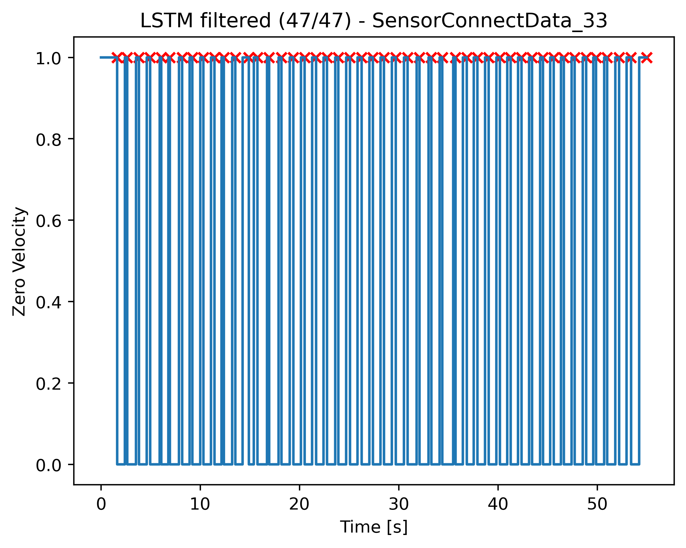

<h2>Gait Driven Inertial Navigation Dataset</h2>

<p align="justify">The following installations are required to run the scripts and reproduce the results presented here and in the paper. Given scripts for creating the <b>pyshoe</b> virtual environment have worked successfully on various Windows systems, although we cannot guarantee compatibility with all system configurations.</p>

<!--
<p align="justify"><b>Note:</b> The Anaconda virtual environment is named <b>pyshoe</b> because initially our research of developing a gait driven inertial navigation system (INS) (also known as a stride and heading (inertial navigation) system - SHS) was completely based on <a href="https://ieeexplore.ieee.org/abstract/document/8533770">PyShoe study</a> and <a href="https://ieee-dataport.org/open-access/university-toronto-foot-mounted-inertial-navigation-dataset">public dataset</a> made by Brandon Wagstaff <i>et al.</i> (<a href="https://starslab.ca/foot-mounted-inertial-navigation-dataset/">University of Toronto STARS Lab. Foot-Mounted Inertial Navigation Dataset</a>). Despite the transition to using exclusively self-collected data and building own inertial odometry public dataset, the original name was retained.</p>
-->

<p align="justify"><b>Note:</b> The Anaconda virtual environment is named <b>pyshoe</b> because our initial research on developing a gait-driven inertial navigation system (INS), also known as a stride and heading system (SHS), was entirely based on the <a href="https://ieeexplore.ieee.org/abstract/document/8533770">PyShoe study</a> and the <a href="https://ieee-dataport.org/open-access/university-toronto-foot-mounted-inertial-navigation-dataset">public dataset</a> released by Brandon Wagstaff <i>et al.</i> (<a href="https://starslab.ca/foot-mounted-inertial-navigation-dataset/">University of Toronto STARS Lab. Foot-Mounted Inertial Navigation Dataset</a>). Although we have since transitioned to using exclusively self-collected data and have built our own inertial odometry public dataset, the original name (for the Python virtual environment) has been retained here.</p>

<h3>Creating <b>pyshoe</b> Virtual Environment in Anaconda</h3>
<p align="justify">After installing Anaconda, launch <b>Anaconda PowerShell</b> and then type</p>

```
conda create --name pyshoe python=3.7
```

<p align="justify">to create <b>pyshoe</b> virtual environment (venv). Subsequently, type</p>

```
conda activate pyshoe
```

<p align="justify">to activate <b>pyshoe</b> venv.</p>

<h3>Installing Required Packages</h3>

<p align="justify">Type and enter the following commands in Anaconda PS terminal to install the required packages and libraries to run PyShoe codes and reproduce the results in the page and the paper. We thank <a href="https://scholar.google.com.tr/citations?user=F2NkKNAAAAAJ&hl=tr">Dr. Ramazan Özgür Doğan</a> for the assistance in setting up the environment.</p>

```
conda install pytorch==1.13.1 torchvision==0.14.1 torchaudio==0.13.1 pytorch-cuda=11.7 -c pytorch -c nvidia
```

```
pip install torch==1.13.1+cu117 torchvision==0.14.1+cu117 torchaudio==0.13.1 --extra-index-url https://download.pytorch.org/whl/cu117
```


<p align="justify">Continue and complete the installation by entering the following commands in Anaconda PS in <b>pyshoe</b> virtual environment.<p>

```
conda install scikit-learn==0.19.1
```

```
conda install matplotlib
```

```
pip install pandas==1.1.5
```

<h3>Installing <b>liegroups</b> package</h3>

<p align="justify">After cloning this repository to your local computer, you must install <b><a href="https://github.com/utiasSTARS/liegroups" target="_blank">liegroups</a></b> package if you would like to reproduce the results shown here in this repo or the paper.</p>

<h3>Inertial Navigation System (INS) vs. Stride & Heading System</h3>

<!--
<p align="justify">In the field of indoor positioning & navigation, in general, INS stands for studies that work with inertial sensor data samples that produce sample-wise location estimation. Robert Harle first defined the stride-wise dead-reckoning method as SHS in his <a href="https://ieeexplore.ieee.org/abstract/document/6407455">indoor inertial positioning systems for pedestrians survey paper</a> in 2013. Recently, Fu <i>et al.</i> introduced <b>sampling frequency driven</b> and <b>gait driven</b> methods titles for INS and SHS, respectively, in their <a href="https://ieeexplore.ieee.org/abstract/document/9918136">AI survey paper on pedestrian navigation with wearable inertial sensors</a>.</p>
-->

<p align="justify">In the field of indoor positioning and navigation, INS generally refers to approaches that utilize inertial sensor data to estimate location on a sample-by-sample basis. The stride-wise dead-reckoning method, known as SHS, was first defined by Robert Harle in his 2013 <a href="https://ieeexplore.ieee.org/abstract/document/6407455">survey paper on indoor inertial positioning systems for pedestrians</a>. More recently, Fu <i>et al.</i> introduced the terms <b>sampling frequency driven</b> and <b>gait driven</b> to distinguish between INS and SHS, respectively, in their <a href="https://ieeexplore.ieee.org/abstract/document/9918136">AI survey paper on pedestrian navigation with wearable inertial sensors</a>.</p>

<h3>PyShoe Vicon Room Experiments - Annotation & Corrections</h3>

<p align="justify">We aim to form a new dataset for developing various <b>gait-driven inertial navigation system (INS)</b> from Vicon room experiments of PyShoe dataset where the experiments are sample-wise annotated pedestrian trajectories. Stride indexes would later be required for training various gait-driven INS.</p>

<p align="justify">Here, some troublesome experiments are shown to understand Zero Velocity (ZV) interval and stride detection problems. The optimal ZV detectors are selected (e.g., SHOE for experiment 4, ARED for experiment 6) with the corresponding optimal threshold values (optimal values are supplied by Wagstaff <i>et. al.</i> in the structure of the mat files for Vicon room experiments of PyShoe dataset) for all Vicon room experiments.</p>

<p align="justify">The process depicted below is the ZV interval and stride index annotation (or correction) of some troublesome trajectories produced in Vicon room experiments (PyShoe dataset). Eventually, ZV interval and stride index detection errors in Vicon data are corrected. Extracted dataset is going to be used in training various modern gait driven INS as mentioned above.</p>

<p align="justify">Please use <b>detect_missed_strides.m</b> located at <b>data/vicon/processed</b> if you like to reproduce the figures related to ZV interval annotation & correction.</p>

<h4>Vicon Room Experiments - Annotation of Missed Stride Indexes</h4>

<p align="justify">To detect the missed ZV interval(s) and consequently the missed stride index(es), supplementary zero-velocity update (ZUPT) detectors such as VICON, ARED, MBGTD or AMVD can be utilized (see OpenShoe or PyShoe studies for the acronyms used here). In general, VICON detector was able to recover the missed ZV interval labels correctly; therefore, in many cases, only VICON ZUPT detector is used as the supplementary detector. Below, the results for experiment 18 is given yet all the results can be seen and accessed in <a href="https://github.com/mtahakoroglu/gait-driven-inertial-navigation-dataset/tree/main/results/figs/vicon">here</a>.</p>


<h4>Experiment 18 (2017-11-22-11-48-35)</h4>

<p align="justify">We see that the 7<sup>th</sup> stride is not detected in the plots below. Notice that this is the example experiment that is shown in the paper.</p>

<!---

--->

<p align="justify">Just like we compensated for the errors in ZV interval and stride index detection in <a href="https://github.com/mtahakoroglu/gait-driven-inertial-navigation-dataset/tree/main/results/figs/vicon">experiments 4, 6, and 11</a>, here VICON ZUPT detector is selected again as the supplementary detector to correctly include the missed stride to the stride & heading system trajectory.</p>


<p align="justify">Integration of filtered optimal ZUPT detector SHOE with the supplementary ZUPT detector (i.e., filtered VICON) enabled successfull detection of the missed stride as shown in the combined ZUPT detector plot above (located at the bottom). The corrected stride & heading system trajectory and ZV labels can be seen below.</p>

<!---

--->

<p align="justify">To see the correction by the supplementary ZUPT detector, check the gif file below.</p>


<!---

--->

<!-- EXPERIMENT 27 is excluded after further examination of the aligned trajectory in the navigation coordinate frame
<h4>Experiment 27 (2017-11-27-11-12-44) - VICON training dataset</h4>

<p align="justify">We see that the strides {9, 16, 17, 18} are not detected in the plots below.</p>


<p align="justify">Unlike for the compensation for the errors in ZUPT phase and stride detection in experiments 4, 6, 11 and 18, here VICON ZUPT detector was not sufficient to detect all missed strides. An additional ZV detector (MBGTD) is exploited to detect the last missed stride.</p>


<p align="justify">Integration of filtered optimal ZUPT detector SHOE with the supplementary ZUPT detectors (i.e., filtered VICON and filtered MBGTD) enabled successfull detection of the missed strideS as shown in the combined ZUPT detector plot above (located at the bottom). The corrected stride & heading system trajectory and ZV labels can be seen below for the experiment 27.</p>


<p align="justify">To see the correction by the supplementary ZUPT detectors, check the gif file inserted below.</p>


-->

<p align="justify"><a href="https://github.com/mtahakoroglu/gait-driven-inertial-navigation-dataset/tree/main/results/figs/vicon">Thus far, due to some undetected steps in Vicon room experiments data</a> (recall that Wagstaff <i>et. al.</i> conducted crawling motion experiments in PyShoe), we examined 56 experiments coarsely in the training dataset <i><b>(i)</b></i> to correct for undetected steps (they are classified as 0 in ZV signal plot despite them actually being 1) and <i><b>(ii)</b></i> to exclude motions like crawling, which are not of type bipedal locomotion. As can be seen above, experiments {4, 6, 11, 18, 30, 32, 36, 38, 43} are corrected with ZV interval and stride index annotations by utilizing supplementary detectors. In <b>vicon_data.py</b> file, right before processing experimental data in a loop, annotated experiments are tagged as -1 as follows:</p>

```
training_data_tag = [1, 0, 0, 0, 0, 0, 0, 0, 0, 0, -1, 1, 0, 1, 1, 1, 1, -1, 1, 1, 1, 1, 1, 1, 1, 1, 0, 1, 1, -1, 1, -1, 0, 0, 0, -1, 1, -1, 1, 1, 1, 1, -1, 1, 1, 1, 0, 0, 0, 0, 1, 1, 0, 0, 0, 0]
```

<p align="justify">where</p>

```
len(training_data_tag) = 56
```

<p align="justify">In the signal processing main loop (where the loop visits each experiment one by one), experiments are accepted as training data for a future gait driven INS according to the absolute values of given tags. In other words, experiments labeled as 1's directly satisfy conditions while the ones labeled as -1s needed corrections on ZV intervals and stride indexes in order to be included in a stride and heading (inertial navigation) system (SHS) training dataset. On the other hand, 0s stand for eliminated experiments due to being nonbipedal locomotion data or unrecoverable errors in ZV intervals and/or stride indexes (we actually emailed Brandon Wagstaff about motion types of experiments yet no documentation was made regarding the motion types (e.g., walking, running, crawling) in the experiments at the time of PyShoe dataset generation). In the decision of labeling an experiment as 0, trajectory (spatial) plots along with IMU data (time series) plots with stride indexes are coarsely examined by using MATLAB and Python environments. Eventually, the elimination of Vicon room data yielded a shrink in the total traveled distance by the pedestrian, which negatively affected the development of a a robust gait and data driven INS. Consequently, additional training data are required. The next section describes dataset expansion/enlargement process.</p>

<p align="justify">After running <b>vicon_data.py</b> file, the following result can be seen in the terminal screen at the very end.</p>

```
Total traveled distance in 34 VICON room experiments (to be used for LLIO training/test) is 920.588 meters.
Total experiment time in 34 VICON room experiments (to be used for LLIO training/test) is 998.695s = 16.645mins.
```

<p align="justify">Despite the significant reduction of Vicon room experiments based on the performance of Zero Velocity (ZV) interval and stride index detection accuracy, further refinement can be achieved. As we expand the dataset with our own collected data and apply gait-driven inertial navigation system (INS) training, analyzing data distributions will allow us to identify and exclude <b>more</b> outlier experiments. This process ensures a more robust and accurate model.</p>

<h3>Training Dataset Expansion/Enlargement for LLIO</h3>

<p align="justify">Here PyShoe (pre-trained LSTM based INS) is applied on our own-collected data for stride index extraction, which is required for LLIO training. In the experiments, we used <a href="https://www.microstrain.com/sites/default/files/applications/files/3dm-gx5-25_datasheet_8400-0093_rev_n.pdf">3DM-GX5-25</a> Lord Microstrain IMU with the sensor data capture software <a href="https://www.microstrain.com/software/sensorconnect">SensorConnect</a>. Notice that the employed IMU is of the same brand (and the family as well) that is used in PyShoe experiments. In this regard, expanded data are expected to be compatible with VICON room data in terms of data properties (e.g., distribution of data).</p>

| 3DM-GX5-25 Sensor | SensorConnect software screen |
| :---: | :---: |
|  |  |


<p align="justify">Experiments conducted here are manually <a href="https://www.dropbox.com/scl/fo/xl6szvjqfh129hxdpxas4/AGWk_iRdc8VASGbUhnKX1Vw?rlkey=9sbdq6vkctspe633cvb5a1jdh&st=gcj793t0&dl=0">annotated by using a ruler</a>. As the VICON room walks/experiments of PyShoe dataset is characteristically very different than hallway traversals, proposed <a href="https://github.com/mtahakoroglu/LLIO">LLIO</a> system required a bigger dataset that accounts for straight walk gait characteristics (at various walking paces). Additionally, realistic experiments (e.g., faster motion, change in speed) are conducted to make the dataset more diverse and thereby the developed data-driven INS more robust.</p>

<p align="justify">Similar to the notation used for VICON room experiments, the start point is called as stride #0, i.e., initial stride. If <b>vicon_data.py</b> is viewed, one can see that ZV labels are (intuitively) filtered for accurate stride index detection. However, the filtered ZV values are not used in the trajectory generation. In other words, the pedestrian trajectories are obtained with the raw (not filtered) LSTM based PyShoe generated ZV labels while the strides that are visualized on the trajectories with marker <b>x</b> correspond to the last index of the ZV intervals of the filtered ZV signals (i.e., stride index).</p>

<p align="justify">As all strides produced a foot-print on the ground that are later measured to form ground-truth data for the experiments, each stride location is called a Ground Control Point (GCP).</p>

<p align="justify"><b>Note:</b> One can run <b>own_data.py</b> to obtain the same results shown below. To learn more about experiment info and results, one can view <b>output.txt</b> log file (located at <b>results/figs/own</b>) recorded while the code was running.</p>

<h4>Experiment 31</h4>

| Stride Indexes |  Trajectory (INS)  |
|  :---:  |  :---:  |
|  |  |

| Zero Velocity |  Trajectory (SHS) |
|  :---:  |  :---:  |
|  |  |

<h4>Experiment 32</h4>

| Stride Indexes |  Trajectory (INS)  |
|  :---:  |  :---:  |
|  |  |

| Zero Velocity |  Trajectory (SHS) |
|  :---:  |  :---:  |
|  |  |

<h4>Experiment 33</h4>

| Stride Indexes |  Trajectory (INS)  |
|  :---:  |  :---:  |
|  |  |

| Zero Velocity |  Trajectory (SHS) |
|  :---:  |  :---:  |
|  |  |

<!--

-->

<h4>Experiment 34</h4>

<p align="justify">Here, the motion speed varies during the experiment as can be seen in the <a href="https://www.youtube.com/shorts/kLczRGQx4Ds">video</a>. PyShoe (LSTM based ZUPT aided ESKF) is able to detect only 22 of 24 strides as can be seen below.</p>

| Stride Indexes |  Trajectory (INS)  |
|  :---:  |  :---:  |
|  |  |

| Zero Velocity |  Trajectory (SHS) |
|  :---:  |  :---:  |
|  |  |

<!--

-->

<h4>Experiment 35</h4>

<p align="justify">Here, the motion speed varies during the experiment as can be seen in the <a href="https://www.youtube.com/shorts/R2UBuftXXrE">video</a>. PyShoe (LSTM based ZUPT aided ESKF) is able to detect only 23 of 28 strides as can be seen below.</p>

| Stride Indexes |  Trajectory (INS)  |
|  :---:  |  :---:  |
|  |  |

| Zero Velocity |  Trajectory (SHS) |
|  :---:  |  :---:  |
|  |  |

<!--

-->

<h4>Experiment 36</h4>

<p align="justify">Here, the motion speed is slow and constant during the experiment as can be seen in the <a href="https://youtu.be/uT7wL-taX08">video</a>. PyShoe (LSTM based ZUPT aided ESKF) is able to detect all 58 strides successfully. Stride#17 annotation is slightly corrected after examination of detected stride indexes on IMU data, i.e., the magnitudes of acceleration and angular velocity vectors.</p>

| Stride Indexes |  Trajectory (INS)  |
|  :---:  |  :---:  |
|  |  |

| Zero Velocity |  Trajectory (SHS) |
|  :---:  |  :---:  |
|  |  |

<!--
| Final Stride Indexes on IMU data |
|  :---:  |
|  |
-->

<h4>Experiment 37</h4>

<p align="justify">Here, the pedestrian speed is normal (walking style) during the experiment. The video of this experiment was recorded but due to a computer SSD hard disk failure, unfortunately it could not be retrieved. Stride #{33, 34, 41, 43, 60} annotations are slightly corrected after coarse examination of detected stride indexes on IMU data, i.e., the magnitudes of acceleration and angular velocity vectors.</p>

| Stride Indexes |  Trajectory (INS)  |
|  :---:  |  :---:  |
|  |  |

| Zero Velocity |  Trajectory (SHS) |
|  :---:  |  :---:  |
|  |  |

<h4>Experiment 38</h4>

<p align="justify">Here, the pedestrian motion becomes extreme in some moments. Therefore, PyShoe LSTM was able to detect 43/60 ZV intervals (and strides) in the trajectory. Missing 17 strides are manually annotated after careful examination of IMU data. Also two stride indexes (i.e., stride 45 and 59) are manually corrected to form the training data for LLIO.</p>

| Stride Indexes |  Trajectory (INS)  |
|  :---:  |  :---:  |
|  |  |

| Zero Velocity |  Trajectory (SHS) |
|  :---:  |  :---:  |
|  |  |

<h4>Experiment 39</h4>

| Stride Indexes |  Trajectory (INS)  |
|  :---:  |  :---:  |
|  |  |

| Zero Velocity |  Trajectory (SHS) |
|  :---:  |  :---:  |
|  |  |

<h4>Experiment 40</h4>

| Stride Indexes |  Trajectory (INS)  |
|  :---:  |  :---:  |
|  |  |

| Zero Velocity |  Trajectory (SHS) |
|  :---:  |  :---:  |
|  |  |

<h4>Experiment 41 (Compensated IMU data)</h4>

| Stride Indexes |  Trajectory (INS)  |
|  :---:  |  :---:  |
|  |  |

| Zero Velocity |  Trajectory (SHS) |
|  :---:  |  :---:  |
|  |  |

<h4>Experiment 42 (Compensated IMU data)</h4>

| Stride Indexes |  Trajectory (INS)  |
|  :---:  |  :---:  |
|  |  |

| Zero Velocity |  Trajectory (SHS) |
|  :---:  |  :---:  |
|  |  |

<h4>Experiment 43 (Compensated IMU data)</h4>

<p align="justify">Experiment 43 video, captured by Gökhan Çetin, can be viewed <a href="https://www.youtube.com/shorts/-nBwdj_sYYA">here</a>.</p>

| Stride Indexes |  Trajectory (INS)  |
|  :---:  |  :---:  |
|  |  |

| Zero Velocity |  Trajectory (SHS) |
|  :---:  |  :---:  |
|  |  |

<h4>Experiment 44 (Compensated IMU data)</h4>

<p align="justify">Experiment 44 video is <a href="https://www.youtube.com/watch?v=xBWOx4vfLdg">here</a>.</p>

| Stride Indexes |  Trajectory (INS)  |
|  :---:  |  :---:  |
|  |  |

| Zero Velocity |  Trajectory (SHS) |
|  :---:  |  :---:  |
|  |  |

<h4>Experiment 45 (Compensated IMU data)</h4>

<p align="justify">Experiment 45 video, captured by Yasin Emir, can be viewed <a href="https://www.youtube.com/shorts/SWT8pragH8U">here</a>.</p>

| Stride Indexes |  Trajectory (INS)  |
|  :---:  |  :---:  |
|  |  |

| Zero Velocity |  Trajectory (SHS) |
|  :---:  |  :---:  |
|  |  |

<h4>Experiment 46 (Compensated IMU data)</h4>

<p align="justify">Experiment 46 video (until stride #50) can be viewed <a href="https://www.youtube.com">here</a>.</p>

| Stride Indexes |  Trajectory (INS)  |
|  :---:  |  :---:  |
|  |  |

| Zero Velocity |  Trajectory (SHS) |
|  :---:  |  :---:  |
|  |  |

<!---
| Final Stride Indexes on IMU data |
|  :---:  |
|  |
--->

<!---
<h3>Experimental Test Results (Own Sensor Data)</h3>

<p align="justify">Note that some experiments do not contain GCP or contain incorrectly documented GCP and thereby are not considered in performance evaluation. Also, in some experiments correct number of strides are not detected (with LSTM based robust ZV detector). These experiments are not used in evalation as well. However, in future, if a better ZV interval detector can be developed and detect all strides without missing any, then mentioned experiments could be involved in evaluation process.</p>

<p align="justify"><b>Note:</b> One can run <b>plot_own_sensor_data.py</b> to obtain the same results shown below. To learn more about experiment info and results, one can view <b>output.txt</b> log file (located at <b>results/figs/own</b>) recorded while the code was running.</p>

<h4>Experiment 6 (GCP not available - not used for performance evaluation)</h4>

| Stride Indexes |  Trajectory (INS)  |
|  :---:  |  :---:  |
|  |  |

| Zero Velocity |  Trajectory (SHS) |
|  :---:  |  :---:  |
|  |  |

<h4>Experiment 11 (GCP not available - not used for performance evaluation)</h4>

| Stride Indexes |  Trajectory (INS)  |
|  :---:  |  :---:  |
|  |  |

| Zero Velocity |  Trajectory (SHS) |
|  :---:  |  :---:  |
|  |  |

<h4>Experiment 13 (GCP not available - not used for performance evaluation)</h4>

| Stride Indexes |  Trajectory (INS)  |
|  :---:  |  :---:  |
|  |  |

| Zero Velocity |  Trajectory (SHS) |
|  :---:  |  :---:  |
|  |  |

<h4>Experiment 14 (GCP not available - not used for performance evaluation)</h4>

| Stride Indexes |  Trajectory (INS)  |
|  :---:  |  :---:  |
|  |  |

| Zero Velocity |  Trajectory (SHS) |
|  :---:  |  :---:  |
|  |  |

<h4>Experiment 15 (GCP available & all strides detected correctly - can be used for performance evaluation)</h4>

| Stride Indexes |  Trajectory (INS)  |
|  :---:  |  :---:  |
|  |  |

| Zero Velocity |  Trajectory (SHS) |
|  :---:  |  :---:  |
|  |  |

<h4>Experiment 16 (GCP available but not correct - not used for performance evaluation)</h4>

<p align="justify">Despite correct detection of all strides, due to errors in GCP documentation, this experiment is not considered in performance evaluation.</p>

| Stride Indexes |  Trajectory (INS)  |
|  :---:  |  :---:  |
|  |  |

| Zero Velocity |  Trajectory  |
|  :---:  |  :---:  |
|  |  |

<h4>Experiment 17 (can be used for performance evaluation)</h4>

| Stride Indexes |  Trajectory (INS)  |
|  :---:  |  :---:  |
|  |  |

| Zero Velocity |  Trajectory (SHS) |
|  :---:  |  :---:  |
|  |  |

<h4>Experiment 18 (can be used for performance evaluation)</h4>

| Stride Indexes |  Trajectory (INS)  |
|  :---:  |  :---:  |
|  |  |

| Zero Velocity |  Trajectory (SHS) |
|  :---:  |  :---:  |
|  |  |

<h4>Experiment 19 (can be used for performance evaluation)</h4>

| Zero Velocity |  Trajectory  |
|  :---:  |  :---:  |
|  |  |

<h4>Experiment 20 (can be used for performance evaluation)</h4>

| Stride Indexes |  Trajectory (SHS)  |
|  :---:  |  :---:  |
|  |  |

| Zero Velocity |  Trajectory  |
|  :---:  |  :---:  |
|  |  |

<h4>Experiment 21 (42/43 strides detected - not used for performance evaluation) - Failure (23<sup>rd</sup> ZV interval (and the corresponding stride) is missed)</h4>

| Stride Indexes |  Trajectory (INS)  |
|  :---:  |  :---:  |
|  |  |

| Zero Velocity |  Trajectory (SHS) |
|  :---:  |  :---:  |
|  |  |

<h4>Experiment 22 (can be used for performance evaluation)</h4>

| Stride Indexes |  Trajectory (INS)  |
|  :---:  |  :---:  |
|  |  |

| Zero Velocity |  Trajectory (SHS) |
|  :---:  |  :---:  |
|  |  |

<h4>Experiment 23 (109/110 strides detected - not used for performance evaluation)</h4>

| Stride Indexes |  Trajectory (INS)  |
|  :---:  |  :---:  |
|  |  |

| Zero Velocity |  Trajectory (SHS) |
|  :---:  |  :---:  |
|  |  |

<h4>Experiment 24 (can be used for performance evaluation)</h4>

| Stride Indexes |  Trajectory (INS)  |
|  :---:  |  :---:  |
|  |  |

| Zero Velocity |  Trajectory  |
|  :---:  |  :---:  |
|  |  |

<h4>Experiment 25 (can be used for performance evaluation)</h4>

| Stride Indexes |  Trajectory (INS)  |
|  :---:  |  :---:  |
|  |  |

| Zero Velocity |  Trajectory (SHS) |
|  :---:  |  :---:  |
|  |  |

<h4>Experiment 26 (can be used for performance evaluation)</h4>

| Stride Indexes |  Trajectory (INS)  |
|  :---:  |  :---:  |
|  |  |

| Zero Velocity |  Trajectory (SHS) |
|  :---:  |  :---:  |
|  |  |

<h4>Experiment 27 (can be used for performance evaluation)</h4>

| Stride Indexes |  Trajectory (INS)  |
|  :---:  |  :---:  |
|  |  |

| Zero Velocity |  Trajectory  |
|  :---:  |  :---:  |
|  |  |

<h4>Experiment 28 - a longer pedestrian traverse (can be used for performance evaluation)</h4>

| Stride Indexes |  Trajectory (INS)  |
|  :---:  |  :---:  |
|  |  |

| Zero Velocity |  Trajectory (SHS) |
|  :---:  |  :---:  |
|  |  |

<h4>Experiment 29 - same path with exp 28 but at a higher pace (can be used for performance evaluation)</h4>

| Stride Indexes |  Trajectory (INS)  |
|  :---:  |  :---:  |
|  |  |

| Zero Velocity |  Trajectory (SHS) |
|  :---:  |  :---:  |
|  |  |

<h4>Experiment 30 - same path with exp 28-29 but at the highest pace, i.e., almost running (54/85 strides detected - not used for performance evaluation)</h4>

| Stride Indexes |  Trajectory (INS)  |
|  :---:  |  :---:  |
|  |  |

| Zero Velocity |  Trajectory (SHS) |
|  :---:  |  :---:  |
|  |  |
-->

<h2>Citation</h2>

<p align="justify">If you use the code or dataset in your research, please cite:</p>

```
@article{gait-driven-inertial-dataset,
title={A New Dataset for Gait Driven Inertial Navigation}, 
author={Gokhan Cetin and Muhammed Taha Koroglu},
year={2025},
eprint={2510.048745},
archivePrefix={arXiv},
primaryClass={cs.RO}
}
```

<!---

<h2>REFERENCES</h2>

<p align="justify" #id="ref10"><a href="#gobacktoref10">[1]</a> <a href="https://starslab.ca/foot-mounted-inertial-navigation-dataset/">University of Toronto STARS Lab. Foot-Mounted Inertial Navigation Dataset</a></p>
<p align="justify" #id="ref11"><a href="#gobacktoref11">[2]</a> Brandon Wagstaff, Valentin Peretroukhin, Jonathan Kelly, July 20, 2021, <a href="https://ieee-dataport.org/open-access/university-toronto-foot-mounted-inertial-navigation-dataset" target="_blank">"University of Toronto Foot-Mounted Inertial Navigation Dataset"</a>, IEEE Dataport, doi: <a href="https://dx.doi.org/10.21227/v1z6-9z84">https://dx.doi.org/10.21227/v1z6-9z84</a>.</p>

<p align="justify" id="ref1"><a href="#gobacktoref1">[1]</a> X. Liu, N. Li and Y. Zhang, <a href="https://ieeexplore.ieee.org/document/9956821" target="_blank">"A Novel Adaptive Zero Velocity Detection Algorithm Based on Improved General Likelihood Ratio Test Detector,"</a> in <i>IEEE Sensors Journal</i>, vol. 22, no. 24, pp. 24479-24492, 2022.</p>
<p align="justify" id="ref2"><a href="#gobacktoref2">[2]</a> B. Wagstaff, V. Peretroukhin and J. Kelly, <a href="https://ieeexplore.ieee.org/document/8115947" target="_blank">"Improving foot-mounted inertial navigation through real-time motion classification,"</a> in <i>2017 International Conference on Indoor Positioning and Indoor Navigation (IPIN)</i>, Sapporo, Japan, 2017, pp. 1-8.</p>
<p align="justify" id="ref3"><a href="#gobacktoref3">[3]</a> E. Sangenis, C. -S. Jao and A. M. Shkel, <a href="https://ieeexplore.ieee.org/abstract/document/9967027" target="_blank">"SVM-based Motion Classification Using Foot-mounted IMU for ZUPT-aided INS,"</a> in <i>2022 IEEE Sensors</i>, Dallas, TX, USA, 2022, pp. 1-4.</p>
<p align="justify" id="ref4"><a href="#gobacktoref4">[4]</a> Y. Wang and A. M. Shkel, <a href="https://ieeexplore.ieee.org/document/8861375" target="_blank">"Adaptive Threshold for Zero-Velocity Detector in ZUPT-Aided Pedestrian Inertial Navigation,"</a> in <i>IEEE Sensors Letters</i>, vol. 3, no. 11, pp. 1-4, 2019.</p>
<p align="justify" id="ref5"><a href="#gobacktoref5">[5]</a> Y. Wang and A. M. Shkel, <a href="https://ieeexplore.ieee.org/document/9133730" target="_blank">"A Review on ZUPT-Aided Pedestrian Inertial Navigation,"</a> in <i>2020 27th Saint Petersburg International Conference on Integrated Navigation Systems (ICINS)</i>, St. Petersburg, Russia, 2020.</p>
<p align="justify" id="ref6"><a href="#gobacktoref6">[6]</a> J. Wahlström, I. Skog, F. Gustafsson, A. Markham and N. Trigoni, <a href="https://ieeexplore.ieee.org/abstract/document/8715398" target="_blank">"Zero-Velocity Detection—A Bayesian Approach to Adaptive Thresholding,"</a> in <i>IEEE Sensors Letters</i>, vol. 3, no. 6, pp. 1-4, June 2019.</p>
<p align="justify" id="ref7"><a href="#gobacktoref7">[7]</a> Z. Meng, Z. Deng, P. Zhang and Z. Li, <a href="https://ieeexplore.ieee.org/document/10472598" target="_blank">"Adaptive Mid-Stance Phase Observer-Aided Pedestrian Inertial Navigation System for Varying Gait Speeds,"</a> in <i>IEEE Internet of Things Journal</i>, vol. 11, no. 12, pp. 21904-21915, 15 June, 2024.</p>
<p align="justify" #id="ref8"><a href="#gobacktoref8">[8]</a> C. . -S. Jao, K. Stewart, J. Conradt, E. Neftci and A. M. Shkel, <a href="https://ieeexplore.ieee.org/document/9244906" target="_blank">"Zero Velocity Detector for Foot-mounted Inertial Navigation System Assisted by a Dynamic Vision Sensor,"</a> in <i>2020 DGON Inertial Sensors and Systems (ISS)</i>, Braunschweig, Germany, 2020, pp. 1-18.</p>
<p align="justify" #id="ref9"><a href="#gobacktoref9">[9]</a> C. -S. Jao, Y. Wang and A. M. Shkel, <a href="https://ieeexplore.ieee.org/document/9278755" target="_blank">"A Zero Velocity Detector for Foot-mounted Inertial Navigation Systems Aided by Downward-facing Range Sensor,"</a> in <i>2020 IEEE SENSORS</i>, Rotterdam, Netherlands, 2020, pp. 1-4.</p>
<p align="justify" #id="ref10"><a href="#gobacktoref10">[10]</a> <a href="https://starslab.ca/foot-mounted-inertial-navigation-dataset/">University of Toronto STARS Lab. Foot-Mounted Inertial Navigation Dataset</a></p>
<p align="justify" #id="ref11"><a href="#gobacktoref11">[11]</a> Brandon Wagstaff, Valentin Peretroukhin, Jonathan Kelly, July 20, 2021, <a href="https://ieee-dataport.org/open-access/university-toronto-foot-mounted-inertial-navigation-dataset" target="_blank">"University of Toronto Foot-Mounted Inertial Navigation Dataset"</a>, IEEE Dataport, doi: <a href="https://dx.doi.org/10.21227/v1z6-9z84">https://dx.doi.org/10.21227/v1z6-9z84</a>.</p>
<p align="justify" #id="ref12"><a href="#gobacktoref10">[12]</a> J. Wahlström and I. Skog, <a href="https://ieeexplore.ieee.org/document/9174869" target="_blank">"Fifteen Years of Progress at Zero Velocity: A Review,"</a> in <i>IEEE Sensors Journal</i>, vol. 21, no. 2, pp. 1139-1151, 15 Jan., 2021.</p>
<p align="justify"#id="ref13"><a href="#gobacktoref13">[13]</a> Guimarães, V.; Sousa, I.; Correia, M.V. <a href="https://www.mdpi.com/1424-8220/21/11/3940" target="_blank">Orientation-Invariant Spatio-Temporal Gait Analysis Using Foot-Worn Inertial Sensors.</a> <i>Sensors</i> 2021, 21, 3940.</p>
<p align="justify"#id="ref14"><a href="#gobacktoref14">[14]</a> Guimarães, V.; Sousa, I.; Correia, M.V. <a href="https://www.mdpi.com/1424-8220/21/22/7517" target="_blank">A Deep Learning Approach for Foot Trajectory Estimation in Gait Analysis Using Inertial Sensors.</a> <i>Sensors</i> 2021, 21, 7517.</p>
<p align="justify"#id="ref15"><a href="#gobacktoref15">[15]</a> J. Li et al., <a href="https://ieeexplore.ieee.org/abstract/document/10229495" taget="_blank">"Learning-Based Stance Phase Detection and Multisensor Data Fusion for ZUPT-Aided Pedestrian Dead Reckoning System,"</a> in <i>IEEE Internet of Things Journal</i>, vol. 11, no. 4, pp. 5899-5911, 15 Feb., 2024.</p>
</ul>

--->