<h5>Experiment 4 (2017-11-22-11-25-20)</h5>

When carefully tracked starting from the initial stride, one can see that the 10th stride is not detected in the trajectory plot shown below. To detect the missed ZV interval(s), supplementary ZUPT detectors such as VICON, ARED, MBGTD or AMVD can be utilized. In general, VICON detector was able to generate ZV labels correctly; therefore, in many cases, only VICON ZUPT detector is used as the supplementary detector.

<!--

-->

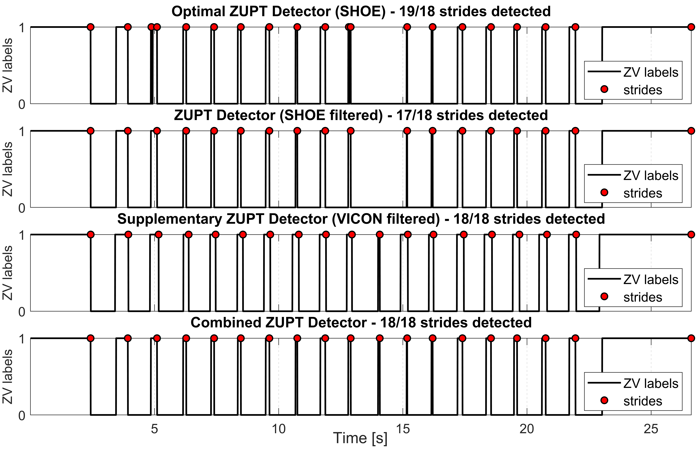

Integration of filtered optimal ZUPT detector SHOE with the filtered supplementary ZUPT detector (i.e., VICON) enabled successful detection of the ZV interval as shown in the combined ZUPT detector plot above (located at the bottom). The corrected ground-truth data (as a sample-wise and a stride & heading system trajectory) and ZV signals can be seen below. Note that the annotation is only going to be used in extracting x-y axes displacement (or displacement and heading change) values for LLIO training dataset generation; therefore, corrected ZV labels are not used in any trajectory generation.

<!--

-->

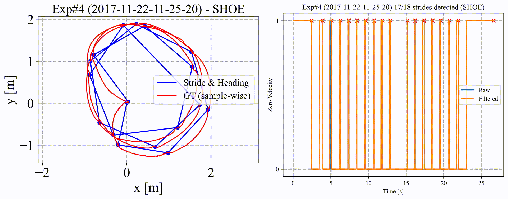

<!--

-->

<h5>Experiment 6 (2017-11-22-11-26-46)</h5>

We see that the 9th stride is not detected in the plots below.

<!---

--->

Just like the way we compensated for the errors in ZV interval and stride detection in experiment 4, here VICON ZUPT detector is selected again as the supplementary detector to correctly detect the missed ZV interval and the stride.

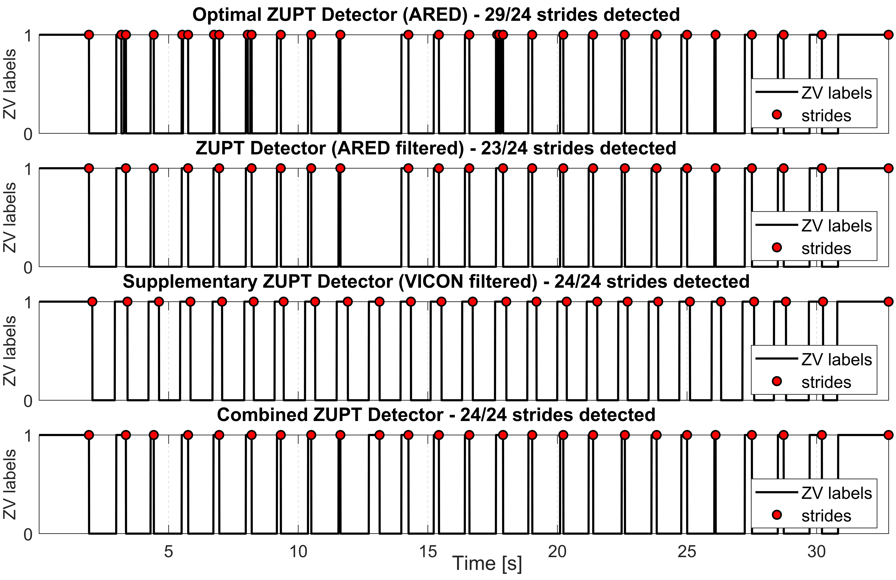

Integration of filtered optimal ZUPT detector SHOE with the supplementary ZUPT detector (i.e., filtered VICON) enabled successfull detection of the missed stride as shown in the combined ZUPT detector plot above (located at the bottom). The corrected stride & heading system trajectory and ZV labels can be seen below for the experiment 6.

<!---

--->

To see the correction by the supplementary ZUPT detector, check the <b>gif</b> file below.

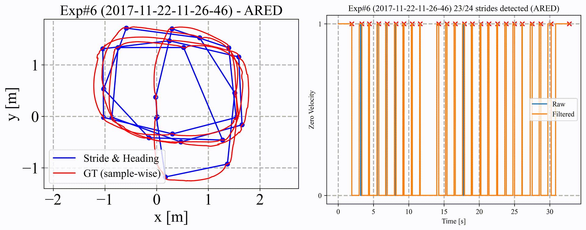

<!---

--->

<h4>Experiment 11 (2017-11-22-11-35-59)</h4>

We see that the 7th stride is not detected in the plots below.

<!---

--->

Just like we compensated for the errors in ZUPT phase and stride detection in experiments 4 and 6, here VICON ZUPT detector is selected again as the supplementary detector to correctly detect the missed stride.

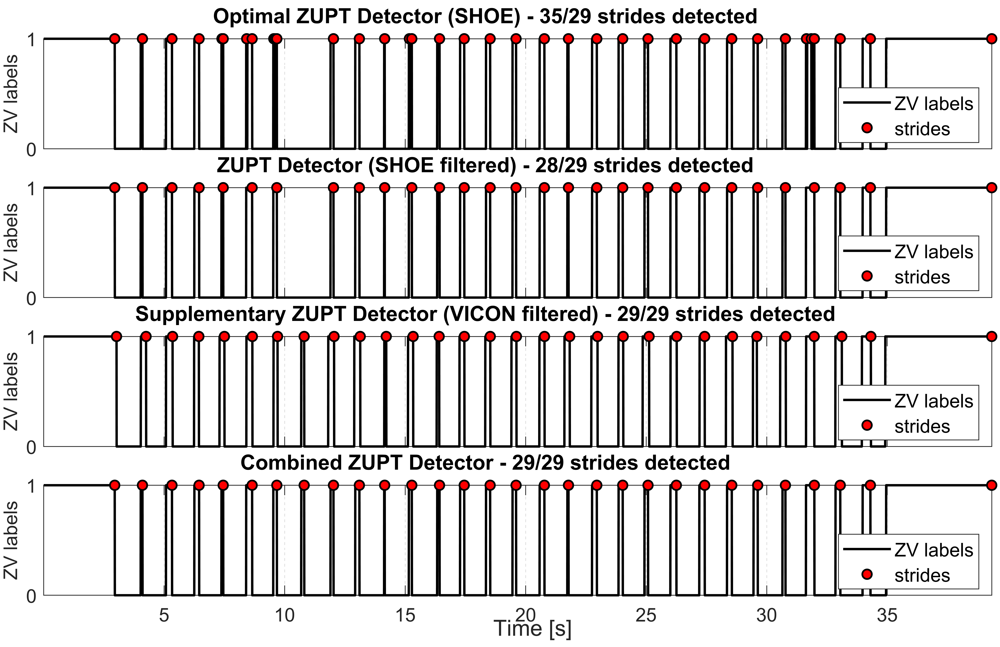

Integration of filtered optimal ZUPT detector SHOE with the supplementary ZUPT detector (i.e., filtered VICON) enabled successfull detection of the missed stride as shown in the combined ZUPT detector plot above (located at the bottom). The corrected stride & heading system trajectory and ZV labels can be seen below.

<!---

--->

To see the correction by the supplementary ZUPT detector, check the gif file below.

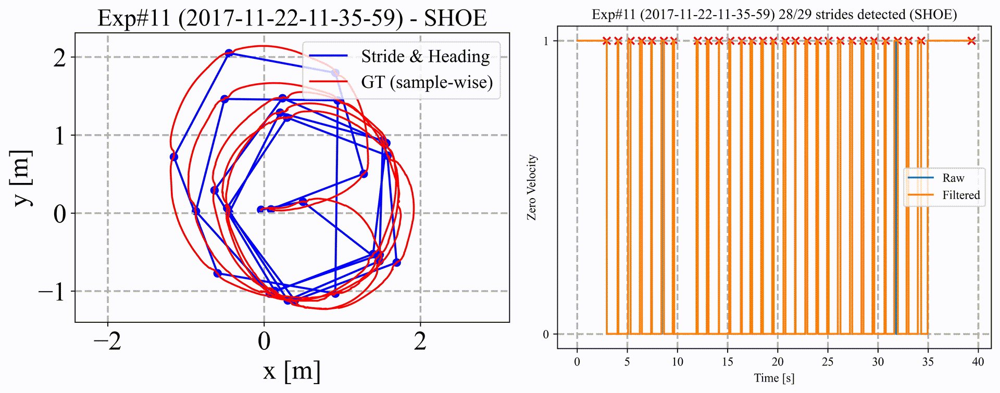

<!---

--->

<h4>Experiment 30 (2017-11-27-11-14-03)</h4>

We see that the strides {2, 10} are not detected in the plots below.

<!---

--->

Unlike experiments {4, 6, 11, 18, 27}, here SHOE ZUPT detector is selected as the supplementary detector to correctly detect the missed strides.

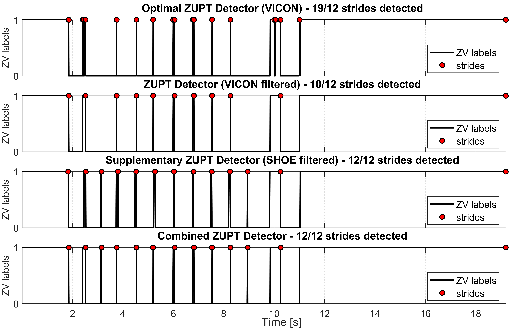

Integration of filtered optimal ZUPT detector VICON with the supplementary ZUPT detector (i.e., filtered SHOE) enabled successfull detection of the missed stride as shown in the combined ZUPT detector plot above (located at the bottom). The corrected stride & heading system trajectory and ZV labels can be seen below for the experiment 30.

<!---

--->

To see the correction by the supplementary ZUPT detector, check the gif file inserted below.

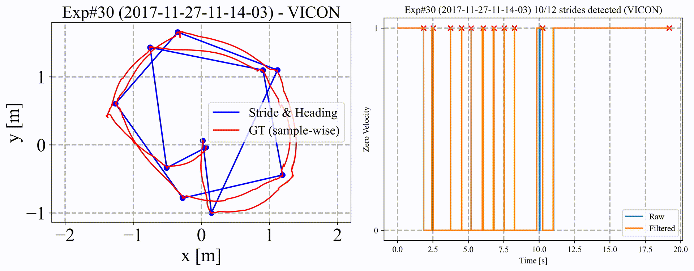

<!---

--->

<h4>Experiment 32 (2017-11-27-11-17-28)</h4>

We see that the strides {9, 11, 20} are not detected in the plots below.

<!---

--->

Unlike experiments {4, 6, 11, 18, 27, 30}, here supplementary detectors were not able to detect all missed strides. While first two was recovered by VICON ZV detector, the last stride needed to be introduced via manual annotation as can be seen below.

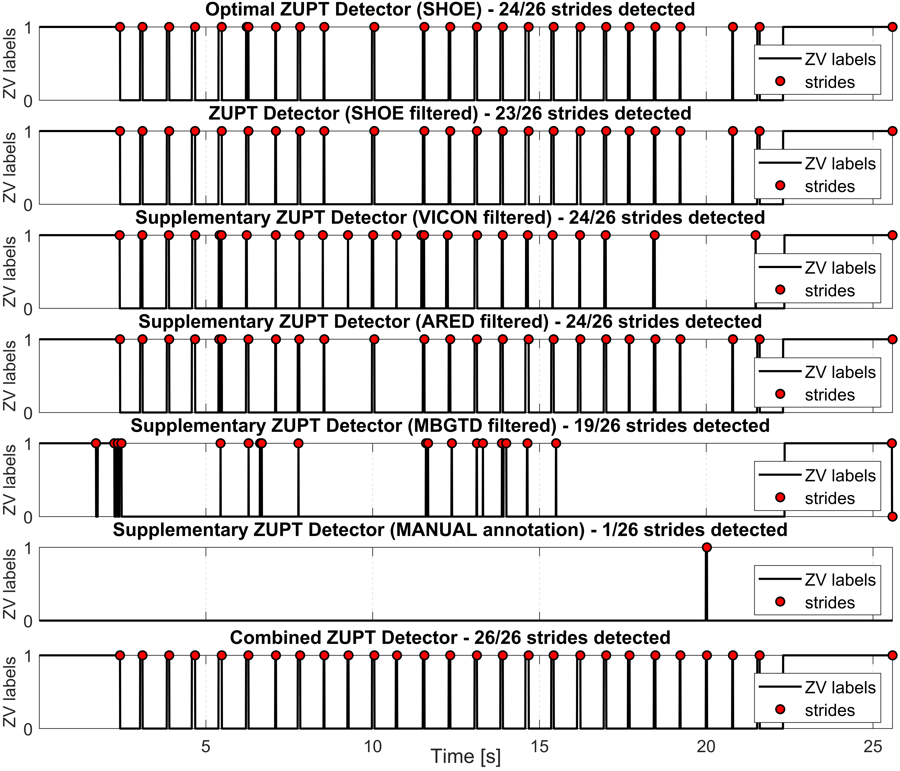

Integration of filtered optimal ZUPT detector SHOE with the supplementary ZUPT detector (i.e., filtered VICON) and the MANUAL ANNOTATION enabled successfull detection of all missed strides as shown in the combined ZUPT detector plot above (located at the bottom). The corrected stride & heading system trajectory and ZV labels can be seen below for the experiment 32.

<!---

--->

To see the correction by the supplementary ZUPT detector, check the gif file inserted below.

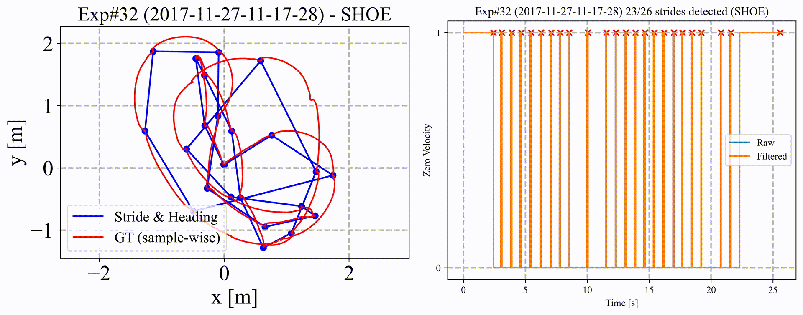

<!---

--->

<h4>Experiment 36 (2017-11-27-11-23-18)</h4>

We see that the 7th stride is not detected in the plots below.

<!---

--->

Just like the 4th experiment, here the supplementary detector is selected as VICON, which was able to recover the missed stride.

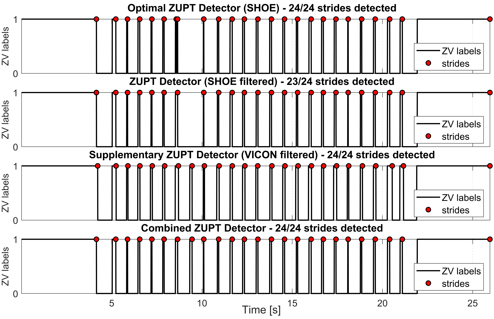

Integration of filtered optimal ZUPT detector SHOE with the supplementary ZUPT detector (i.e., filtered VICON) enabled successfull detection of the missed stride as shown in the combined ZUPT detector plot above (located at the bottom). The corrected stride & heading system trajectory and ZV labels can be seen below for the experiment 36.

<!---

--->

To see the correction by the supplementary ZUPT detector, check the gif file below.

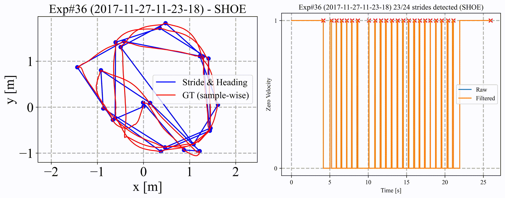

<!---

--->

<h4>Experiment 38 (2017-11-27-11-25-12)</h4>

We see that the strides {3, 27, 33} are not detected in the plots below.

<!---

--->

The supplementary detector is selected as VICON, which was able to recover the missed strides all.

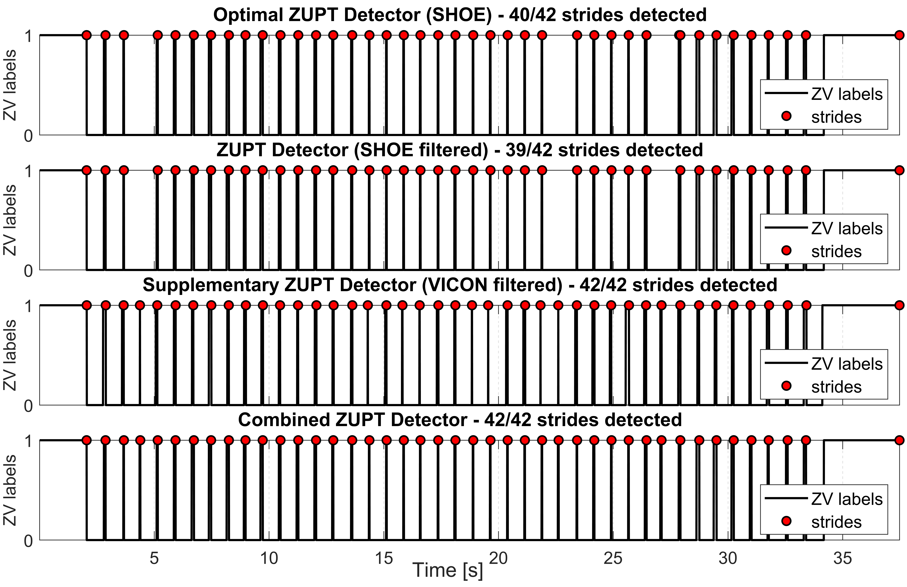

Integration of filtered optimal ZUPT detector SHOE with the supplementary ZUPT detector (i.e., filtered VICON) enabled successfull detection of the missed strides as shown in the combined ZUPT detector plot above (located at the bottom). The corrected stride & heading system trajectory and ZV labels can be seen below for the experiment 38.

<!---

--->

To see the correction by the supplementary ZUPT detector, check the gif file inserted below.

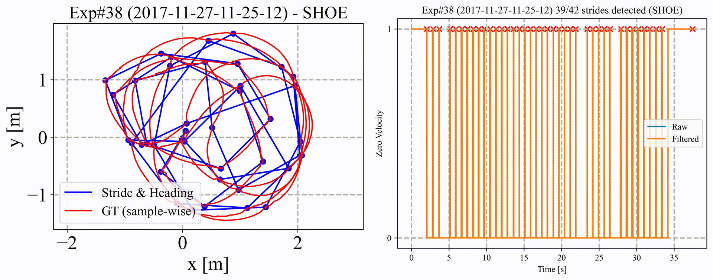

<!---

--->

<h4>Experiment 43 (2017-12-15-18-01-18)</h4>

We see that the strides {3, 14, 16} are not detected in the plots below.

<!---

--->

The supplementary detector is selected as VICON, which was able to recover the missed strides all.

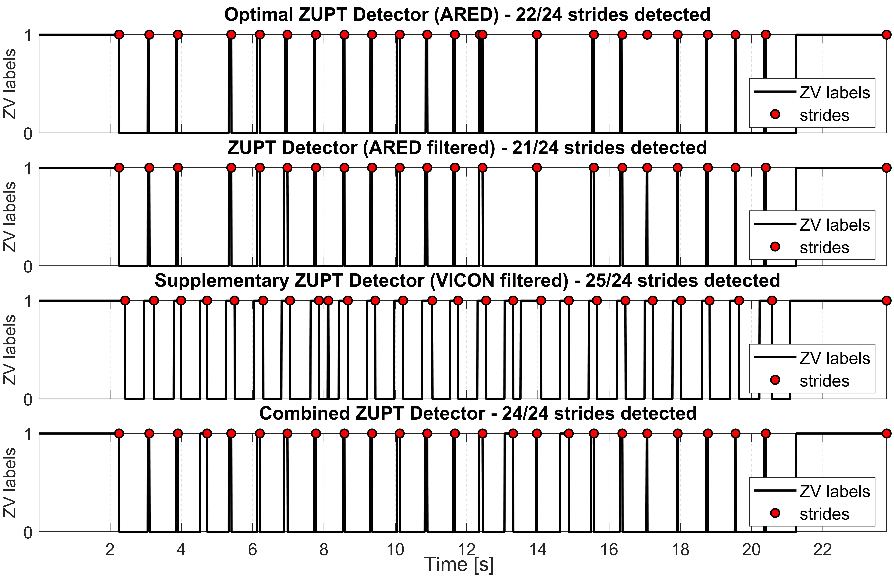

Integration of filtered optimal ZUPT detector SHOE with the supplementary ZUPT detector (i.e., filtered VICON) enabled successfull detection of the missed strides as shown in the combined ZUPT detector plot above (located at the bottom). The corrected stride & heading system trajectory and ZV labels can be seen below for the experiment 43.

<!---

--->

To see the correction by the supplementary ZUPT detector, check the gif file inserted below.

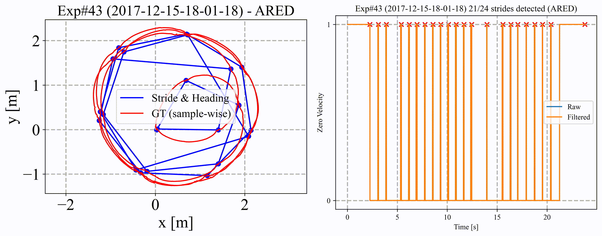

<!---

--->